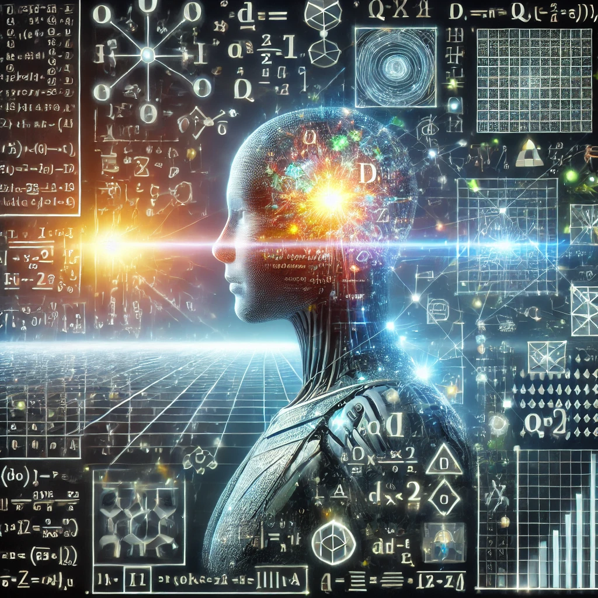

# Basic Math Skills for Machine Learning

Mathematics has many branches such as probability, information theory, optimization, geometry, and so on. However, a computer scientist typically has good engineering skills that improve efficiency in projects. On the other hand, some branches of mathematics can provide new perspectives in projects. This repository aims to explain some basic mathematical skills and demonstrate them through simple case studies with code.

# Context
- 0.Sampling methods
- 1.Variational inference
- 2.Stochastic Process and SDE
- 3.Optimal transport
- 4.Advanced diffusion models
- 5.Information theory
- 6.Concentration inequalities

